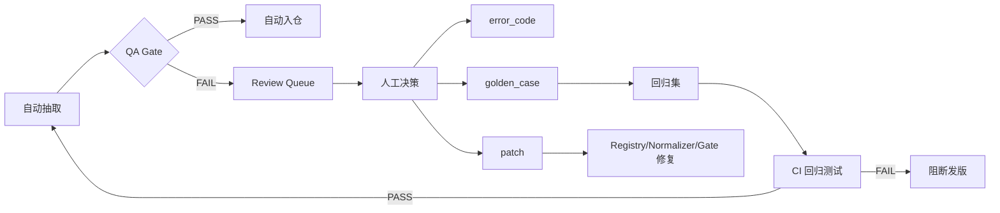

# 6 个抽取器：正确性保障 & 冷启动策略深度分析

## 核心结论

> [!IMPORTANT]
> **技术选型结论**：edgartools（结构化对象 + XBRL） > XML xpath > 正则锚定 > LLM 归一化。**spaCy 不上**。不是"edgartools + 正则 + spaCy"三件套，而是 **edgartools + 声明式 registry + QA gate** 三件套。

目标不是"永不出错"，而是：**错误率尽可能低 → 错误能被自动发现 → 修一次不再重复**。

---

## 一、每个抽取器的正确性边界

按可靠性从高到低排列，每层有不同的正确性保障策略：

### Tier 1：确定性抽取（预期准确率 ≥ 99%）

| 抽取器 | 数据来源 | 为什么可靠 | 可能出错的场景 |
|--------|---------|-----------|--------------|
| `ObjPathExtractor` | edgartools `filing.obj()` 暴露的 typed 属性 | edgartools 已做 XML/XBRL → Python 对象的映射，由社区维护和回归测试 | edgartools 升级改了 API；冷门表单的 obj() 返回 None |
| `XbrlConceptExtractor` | `filing.xbrl()` → `facts.query().by_concept()` | XBRL 是 SEC 强制要求的结构化标记，concept 名由 taxonomy 规范定义 | 公司使用 extension taxonomy 自定义 concept；period/dimension 选错 |
| `XmlPathExtractor` | 直接 xpath 解 SEC 标准 XML schema | 3/4/5、13D/G、13F、144 都有 SEC 发布的 XML technical spec | schema 版本升级（极少见）；XML 格式不合规（SEC 会拒收，概率极低） |

**保障手段**：
- **不需要正则或 NLP**，直接走 API 或 xpath
- QA 层只做边界校验（`nonnegative`, `max_abs`, `min/max` 范围检查）
- 若取值为空，记录 `locator_kind` + 失败原因，尝试下一个 locator

### Tier 2：半结构化抽取（预期准确率 85–95%）

| 抽取器 | 数据来源 | 为什么不如 Tier 1 | 可能出错的场景 |
|--------|---------|------------------|--------------|
| `AnchoredTableExtractor` | HTML 表格：先定位 section，再按 row alias 取值 | HTML 不是标准格式；表头措辞因公司而异 | 表结构嵌套 / 合并单元格；row alias 没覆盖到的措辞变体；单位信息在表头而非单元格 |
| `AnchoredSpanExtractor` | 先切 section/item/window，再存 span | 依赖 section 定位的准确性 | section 标题变体多；span 切割边界不准；新版式的布局变化 |

**保障手段**：
- **正则在这里用**，但只做 **section header 锚定** 和 **row label 匹配**，不裸跑全文
- 每个字段最多 10 个 alias，超过就说明应该升级到 Tier 1 的结构化来源
- 交叉校验：同一个值如果 Tier 1 也出了，必须一致

### Tier 3：LLM 归一化（准确率取决于 span 质量）

| 抽取器 | 输入 | 输出 | 风险 |
|--------|-----|-----|------|
| `LlmSpanNormalizer` | 已切好的 1–3KB span | 按 JSON schema 输出结构化判断 | LLM 幻觉；schema violation；前后不一致 |

**保障手段**：
- **只吃 pre-cut span**，不吃整篇 filing
- 强制 JSON schema 校验（Pydantic model）
- 温度设为 0，使用 structured output / function calling
- 对同一 span 可跑两次取一致性；不一致则进 review

---

## 二、冷启动怎么做？

冷启动是最脆弱的阶段。核心原则：**先收集 evidence，后信任自动值**。

### Phase 0：构建 Golden Set（第一天）

```
for each form_family in [10-K, 8-K, Form4, 13F, 13D, DEF14A, ...]:
    手工选 5 个 well-known company (AAPL, MSFT, GOOG, JPM, JNJ)
    下载最新 2 份 filing
    对每个字段手工标注 ground truth
    → 生成 ~60-100 条 golden records
```

> [!TIP]
> 选大公司的原因：它们的 filing 格式最标准，XBRL coverage 最全，edgartools typed object 支持最好。先让 Tier 1 抽取器在"简单场景"上验证通过。

### Phase 1：Tier 1 Only（第一周）

```python
# 只启用确定性抽取器
ENABLED_LOCATORS = ["obj_path", "xbrl_concept", "xml_path"]

# 所有结果都带 confidence + evidence
# 跑完后与 golden set 对比 → 修 registry → 重跑
```

- 只处理 Tier 1 有 locator 的字段
- 所有结果对比 golden set，precision/recall 都要 ≥ 95% 才放行
- 不达标的字段**不上线**，标记 `needs_review`

### Phase 2：开放 Tier 2（第二周）

- 在 Tier 1 验证通过后，启用 `AnchoredTableExtractor` / `AnchoredSpanExtractor`
- 但只处理 Tier 1 **没覆盖到的字段**（如 `use_of_proceeds_quant`、部分 HTML-only 表）
- 交叉校验：对于 Tier 1 已有值的字段，Tier 2 出的值必须一致

### Phase 3：开放 LLM + 扩展覆盖（第三周）

- `LlmSpanNormalizer` 只开放给 `片段型字段`
- 冷启动期 LLM 输出全部进 review queue
- 收集 50 条人工确认的 LLM 输出后，才转为自动 accept

### 冷启动期的特殊 Review Gate

```python
def cold_start_review_gate(field_result, field_spec, stats):
    # 冷启动期，任何字段在该 issuer 首次出现时都进审
    if stats.issuer_field_count(field_result.cik, field_spec.name) == 0:
        return ReviewDecision.NEEDS_REVIEW, "first_seen_for_issuer"

    # 冷启动期，新模板首次出现时进审
    if stats.template_field_count(field_result.template_hash, field_spec.name) == 0:
        return ReviewDecision.NEEDS_REVIEW, "first_seen_template"

    # 与历史值偏差 >50% 的进审
    if stats.zscore(field_result.value, field_spec.name) > 3.0:
        return ReviewDecision.NEEDS_REVIEW, "outlier_vs_history"

    return ReviewDecision.ACCEPTED, None
```

---

## 三、为什么不用 spaCy？

| 维度 | spaCy 的作用 | 本项目的实际需求 | 结论 |
|-----|------------|---------------|------|
| NER | 识别公司名、人名、金额 | edgartools 已给了 issuer_name, insider_name, amounts | **不需要** |
| 文本分类 | 分类 risk factor 类型 | 用 LLM + JSON schema 更直接 | **不如 LLM** |
| 依赖解析 | 判断句子中值的归属关系 | 值从表格/XBRL 取，不从句子取 | **不需要** |
| Tokenization | 切词 | 用正则做 header/label 匹配足够 | **不需要** |

> [!WARNING]
> 上 spaCy 的隐性成本：需要训练/微调模型、维护模型版本、管理 GPU/CPU 推理资源、处理 tokenizer 不一致。对于一个 **结构定位问题**，这些成本全是浪费。

**唯一可能需要 spaCy 的未来场景**：Owner route 中 footnote 的复杂条件解析（如 "pursuant to a 10b5-1 plan, exercisable in 3 installments"），但这属于 Phase 2+ 的优化，不是现在的问题。

---

## 四、如何保证"修一次不再错"？

### 错误闭环的 4 个必须步骤



### 每次人工修正产出的 3 件东西

| 产出 | 内容 | 怎么用 |
|-----|------|-------|
| `error_code` | 错因分类：`WRONG_ROW_MATCH`, `UNIT_SCALE_ERROR`, `MULTIPLE_CANDIDATES`, `CANONICAL_FIELD_MISMATCH` | 统计哪类错最多，优先修 |
| `golden_case` | `(accession_no, field_name, expected_value, expected_locator_kind)` 加入回归集 | 每次发版必跑，不过不发 |
| `patch` | 根据错因修对应层：映射缺失→改 registry、单位错→改 normalizer、该审没审→改 review gate | 定向修复，不污染通用规则 |

### 防膨胀规则

只有同时满足以下至少两条的错误，才值得产品化修复：
1. **重复出现**（≥3 个不同 filing 出现同类错误）
2. **可归纳**（能写成一条通用规则）
3. **无副作用**（修了不会让别的样本出错）

否则：只做 **one-off human override**，打上 `override_reason`，存入仓但不改规则。

---

## 五、技术栈总结

```
┌─────────────────────────────────────────────────────┐
│                   Field Registry (YAML)              │
│   field → form_family → locators[] → normalizer → qa │
└──────────────────────┬──────────────────────────────┘
                       │
        ┌──────────────┼──────────────┐
        ▼              ▼              ▼
   ┌─────────┐   ┌──────────┐   ┌──────────┐
   │ Tier 1  │   │ Tier 2   │   │ Tier 3   │
   │ edgar-  │   │ Anchored │   │ TXT Span │
   │ tools   │   │ Table/   │   │          │
   │ + XBRL  │   │ Span     │   │          │
   │ + XML   │   │ + regex  │   │          │
   └────┬────┘   └────┬─────┘   └────┬─────┘
        │              │              │
        └──────────────┼──────────────┘
                       ▼
              ┌────────────────┐
              │   QA Gate      │
              │ range check    │
              │ cross-validate │
              │ z-score        │
              │ template hash  │
              └───────┬────────┘
                      │
            ┌─────────┼─────────┐
            ▼                   ▼
     ┌────────────┐     ┌────────────┐
     │ Auto Accept│     │ Review     │
     │ → DB       │     │ Queue      │
     └────────────┘     └─────┬──────┘
                              ▼
                    ┌──────────────────┐
                    │ Human Decision   │
                    │ → error_code     │
                    │ → golden_case    │
                    │ → patch          │
                    └──────────────────┘
```

### 不用的东西

| 技术 | 为什么不用 |
|-----|----------|
| spaCy | 本项目是结构定位问题，不是 NER 问题 |
| 全文正则 | 维护成本爆炸；用 section 锚定后的局部正则代替 |
| LLM 找值 | LLM 只做归一化，不做定位 |
| 手工 alias 无限扩展 | 超过 10 个 alias 就升级数据源 |

### 必须用的东西

| 技术 | 用途 |
|-----|------|
| edgartools `filing.obj()` | Tier 1 主力：typed object 直接取值 |
| edgartools `filing.xbrl()` + `facts.query()` | Tier 1 主力：XBRL concept 查询 |
| lxml xpath | Tier 1：XML 表单的确定性解析 |
| 声明式 YAML registry | 字段配置与代码解耦 |
| Pydantic | LLM 输出的 schema 校验 |
| 回归测试 golden set | 修一次不再错的工程保障 |

---

## 六、回答你的三个问题

### Q1：如何保证最大化正确？

**分层信任 + fallback chain**。Tier 1 能取的字段绝不退到 Tier 2。每个字段的 locator 按可靠性排序，第一个通过 QA 的值即为 accepted value。

### Q2：如何减少人工修正（尤其冷启动）？

**冷启动不等于"全量人审"**。冷启动 = Tier 1 only + golden set 验证 + 逐步放开。预计 60–70% 的字段（所有 XML/XBRL 覆盖的数值字段）在冷启动第一天就能自动通过，因为它们走的是确定性解析。

### Q3：如何保证之后不再错？

**error_code + golden_case + patch 三件套**。每条人工修正都沉淀进回归集，每次发版必须回归通过。新增规则必须来自回归集，不因单个怪样本加专用正则。
