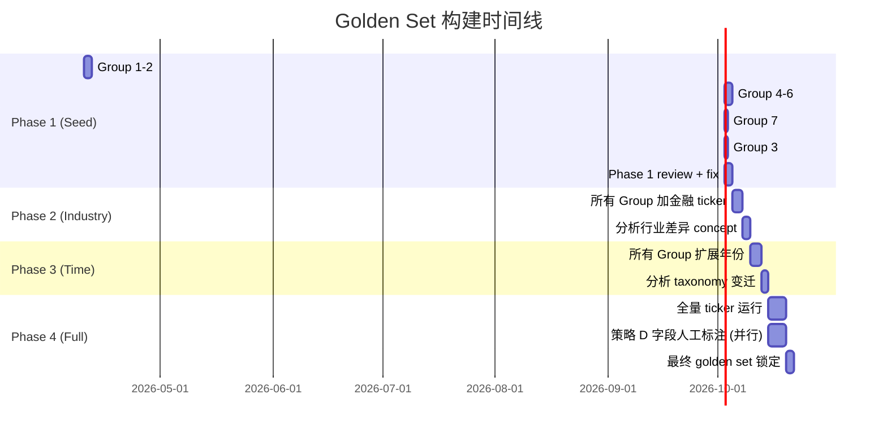

# Golden Set 设计方案（数值字段全覆盖）

> 本文档覆盖 EXTRACTION_FILED.md 中全部 3 个 route 的 **53 个数值字段**，不含片段型字段。

---

## 一、字段全景：53 个数值字段 × 3 种 truth 来源

每个字段天然属于某种 truth 获取策略。不同策略的 golden set 构建方式完全不同，不能一刀切。

### Truth 策略分类

| 策略 | 适用条件 | Truth 来源 | 可自动化程度 |
|------|---------|-----------|------------|
| **A: companyfacts** | 有 XBRL、SEC 已聚合 | `data.sec.gov/api/xbrl/companyfacts` | 全自动 |
| **B: xml_obj** | 表单有 XML schema、edgartools 有 typed obj | edgartools `filing.obj()` 直接取值 | 全自动 |
| **C: cross_validate** | 无外部 truth，但可通过数学关系推导/校验 | 会计恒等式、fee table 内部一致性 | 半自动 |
| **D: manual_seed** | 无结构化来源，需人工初始标注 | 人工读原文标注 20–30 条 | 人工 |

### 字段 → Truth 策略完整映射

#### Issuer Route（27 字段）

| # | 字段 | 适用表单 | Truth 策略 | 说明 |
|---|------|---------|-----------|------|
| 1 | `total_revenue` | 10-K/10-Q/20-F | **A** | companyfacts: `Revenues`, `RevenueFromContractWithCustomerExcludingAssessedTax`, `SalesRevenueNet` |
| 2 | `operating_income` | 10-K/10-Q/20-F | **A** | companyfacts: `OperatingIncomeLoss` |
| 3 | `net_income` | 10-K/10-Q/20-F | **A** | companyfacts: `NetIncomeLoss` |
| 4 | `diluted_eps` | 10-K/10-Q/20-F | **A** | companyfacts: `EarningsPerShareDiluted` |
| 5 | `cash_and_equivalents` | 10-K/10-Q/20-F | **A** | companyfacts: `CashAndCashEquivalentsAtCarryingValue` |
| 6 | `total_debt` | 10-K/10-Q/20-F | **A+C** | companyfacts: `LongTermDebt` + `ShortTermBorrowings`; cross_check: 两者之和 |
| 7 | `operating_cash_flow` | 10-K/10-Q/20-F | **A** | companyfacts: `NetCashProvidedByUsedInOperatingActivities` |
| 8 | `capex` | 10-K/10-Q/20-F | **A** | companyfacts: `PaymentsToAcquirePropertyPlantAndEquipment` |
| 9 | `shares_outstanding` | 10-K/10-Q/20-F | **A** | companyfacts: `CommonStockSharesOutstanding` (dei taxonomy) |
| 10 | `total_revenue` | S-1/424B4 | **C** | S-1 含历史财务表；同样的 XBRL concept 但 form=S-1 |
| 11 | `operating_income` | S-1/424B4 | **C** | 同上 |
| 12 | `net_income` | S-1/424B4 | **C** | 同上 |
| 13 | `diluted_eps` | S-1/424B4 | **C** | 同上 |
| 14 | `filing_delay_days` | NT 10-Q/NT 10-K | **D** | 纯文本推导，需人工标注 |
| 15 | `gross_proceeds` | S-1/424B4 | **C** | cross_check: ≈ price × qty |
| 16 | `net_proceeds` | S-1/424B4 | **C** | cross_check: ≈ gross - underwriter_discount |
| 17 | `offering_price_per_share` | S-1/424B4 | **C** | fee table / cover page |
| 18 | `securities_offered_qty` | S-1/424B4 | **C** | fee table / cover page |
| 19 | `underwriter_discount_total` | S-1/424B4 | **C** | cross_check: ≈ gross - net |
| 20 | `deal_value` | 8-K/6-K/SC TO-I/SC 13E3 | **D** | 无结构化来源 |
| 21 | `offer_price_per_share` | SC TO-I/SC 13E3/8-K | **D** | 无结构化来源 |
| 22 | `tender_shares_sought` | SC TO-I | **D** | 无结构化来源 |
| 23 | `financing_commitment_amount` | 8-K/SC TO-I/SC 13E3/S-1 | **D** | 无结构化来源 |
| 24 | `termination_fee` | 8-K/SC TO-I/SC 13E3 | **D** | 无结构化来源 |
| 25 | `exec_total_comp` | DEF 14A/S-1 | **B** | edgartools: `proxy.executive_compensation` DataFrame |
| 26 | `holder_beneficial_ownership_shares` | DEF 14A/S-1/424B4 | **D** | HTML table，需锚定 |
| 27 | `holder_beneficial_ownership_pct` | DEF 14A/S-1/424B4 | **D** | HTML table，需锚定 |

*注：proposal_votes_for/against/abstain/broker_non_votes (4 字段) 属于 8-K Item 5.07，策略 **D**。合计 27+4=31 但后 4 个不在上表重复列出。*

#### Owner Route（18 字段）

| # | 字段 | 适用表单 | Truth 策略 | 说明 |
|---|------|---------|-----------|------|
| 1 | `non_derivative_shares_owned` | 3/4/5 | **B** | XML + edgartools obj |
| 2 | `derivative_underlying_shares` | 3/4/5 | **B** | XML + edgartools obj |
| 3 | `shares_acquired_or_disposed` | 4/5 | **B** | XML + edgartools obj |
| 4 | `transaction_price_per_share` | 4/5 | **B** | XML + edgartools obj |
| 5 | `shares_owned_following_txn` | 4/5 | **B+C** | XML obj + cross: prior ± delta |
| 6 | `exercise_or_conversion_price` | 3/4/5 | **B** | XML + edgartools obj |
| 7 | `beneficially_owned_shares` | 13D/13G | **B** | edgartools: `schedule.total_shares` |
| 8 | `beneficial_ownership_pct` | 13D/13G | **B** | edgartools: `schedule.total_percent` |
| 9 | `sole_voting_power` | 13D/13G | **B** | edgartools: `person.sole_voting_power` |
| 10 | `shared_voting_power` | 13D/13G | **B** | 同上 |
| 11 | `sole_dispositive_power` | 13D/13G | **B** | 同上 |
| 12 | `shared_dispositive_power` | 13D/13G | **B** | 同上 |
| 13 | `aggregate_purchase_price` | 13D | **B** | edgartools obj |
| 14 | `source_of_funds_amount` | 13D | **D** | 半结构化文本 |
| 15 | `proposed_sale_shares` | 144 | **B** | edgartools: `form144.units_to_sell` |
| 16 | `proposed_sale_market_value` | 144 | **B** | edgartools: `form144.market_value` |
| 17 | `shares_sold_past_3m` | 144 | **B** | edgartools: `form144.sold_past_3_months` |
| 18 | `market_value_sold_past_3m` | 144 | **B** | edgartools: `form144.proceeds_past_3_months` |

#### Holdings Route（8 字段）

| # | 字段 | 适用表单 | Truth 策略 | 说明 |
|---|------|---------|-----------|------|
| 1 | `position_value_usd` | 13F-HR | **B+C** | XML info table; cross: sum = total |
| 2 | `shares_or_principal_amount` | 13F-HR | **B** | XML info table |
| 3 | `sole_voting_auth_shares` | 13F-HR | **B** | XML info table |
| 4 | `shared_voting_auth_shares` | 13F-HR | **B** | XML info table |
| 5 | `none_voting_auth_shares` | 13F-HR | **B** | XML info table |
| 6 | `other_included_managers_count` | 13F-HR | **B** | cover page XML |
| 7 | `info_table_entry_total` | 13F-HR | **B+C** | cross: = count(positions) |
| 8 | `info_table_value_total_usd` | 13F-HR | **B+C** | cross: = sum(position_value) |

### 按策略统计

| Truth 策略 | 字段数量 | Golden set 构建难度 |
|-----------|---------|-------------------|
| **A: companyfacts** | 9 | ⭐ 最简单，全自动 |
| **B: xml_obj** | 27 | ⭐ 简单，edgartools 直接取 |
| **C: cross_validate** | 8 (含重叠) | ⭐⭐ 中等，需实现校验逻辑 |
| **D: manual_seed** | ~12 | ⭐⭐⭐ 最难，需人工标注 |

> [!IMPORTANT]
> **关键发现：53 个字段中，36 个可以全自动构建 golden set（策略 A + B），占 68%。只有 ~12 个字段需要人工介入。**

---

## 二、分组设计：7 个 Validation Group

字段按**可互相校验的关系**分组，不是按顺序。每组在同一次 run 中一起跑、一起校验。

### Group 1: Income Statement Chain（策略 A）
```yaml
name: income_statement
form_family: [10-K, 10-Q, 20-F]
fields:
  - total_revenue
  - operating_income
  - net_income
  - diluted_eps
  - shares_outstanding
cross_checks:
  - "total_revenue >= operating_income"
  - "operating_income >= net_income (通常)"
  - "abs(diluted_eps - net_income / shares_outstanding) < 0.05"
truth_source: companyfacts API
concept_candidates:
  total_revenue:
    - us-gaap:Revenues
    - us-gaap:RevenueFromContractWithCustomerExcludingAssessedTax
    - us-gaap:SalesRevenueNet
    - us-gaap:RevenueFromContractWithCustomerIncludingAssessedTax
  operating_income:
    - us-gaap:OperatingIncomeLoss
    - us-gaap:IncomeLossFromContinuingOperationsBeforeIncomeTaxesExtraordinaryItemsNoncontrollingInterest
  net_income:
    - us-gaap:NetIncomeLoss
    - us-gaap:ProfitLoss
  diluted_eps:
    - us-gaap:EarningsPerShareDiluted
  shares_outstanding:
    - dei:EntityCommonStockSharesOutstanding
    - us-gaap:CommonStockSharesOutstanding
```

### Group 2: Balance Sheet + Cash Flow（策略 A）
```yaml
name: balance_sheet_cashflow
form_family: [10-K, 10-Q, 20-F]
fields:
  - cash_and_equivalents
  - total_debt
  - operating_cash_flow
  - capex
cross_checks:
  - "cash_and_equivalents >= 0"
  - "total_debt >= 0"
  - "operating_cash_flow 与 net_income 同号（通常）"
truth_source: companyfacts API
concept_candidates:
  cash_and_equivalents:
    - us-gaap:CashAndCashEquivalentsAtCarryingValue
    - us-gaap:CashCashEquivalentsAndShortTermInvestments
  total_debt:
    derived: "LongTermDebt + LongTermDebtCurrent + ShortTermBorrowings"
    fallback:
      - us-gaap:DebtInstrumentCarryingAmount
  operating_cash_flow:
    - us-gaap:NetCashProvidedByUsedInOperatingActivities
  capex:
    - us-gaap:PaymentsToAcquirePropertyPlantAndEquipment
    - us-gaap:CapitalExpenditureDiscontinuedOperations
```

### Group 3: Offering / IPO（策略 C）
```yaml
name: offering
form_family: [S-1, 424B4]
fields:
  - gross_proceeds
  - net_proceeds
  - offering_price_per_share
  - securities_offered_qty
  - underwriter_discount_total
cross_checks:
  - "abs(gross_proceeds - offering_price_per_share * securities_offered_qty) / gross_proceeds < 0.02"
  - "abs(net_proceeds - (gross_proceeds - underwriter_discount_total)) / gross_proceeds < 0.02"
  - "underwriter_discount_total > 0"
  - "offering_price_per_share > 0"
truth_source: fee_table 内部一致性 + 少量人工确认
```

### Group 4: Insider Ownership - Section 16（策略 B）
```yaml
name: section16_ownership
form_family: [3, 4, 5]
fields:
  - non_derivative_shares_owned
  - derivative_underlying_shares
  - shares_acquired_or_disposed
  - transaction_price_per_share
  - shares_owned_following_txn
  - exercise_or_conversion_price
cross_checks:
  # Form 4/5 only:
  - "shares_owned_following_txn ≈ prior_balance + shares_acquired - shares_disposed"
  - "transaction_price_per_share > 0 (if market trade)"
truth_source: edgartools filing.obj() — XML 确定性解析
```

### Group 5: Beneficial Ownership（策略 B）
```yaml
name: beneficial_ownership
form_family: [13D, 13G]
fields:
  - beneficially_owned_shares
  - beneficial_ownership_pct
  - sole_voting_power
  - shared_voting_power
  - sole_dispositive_power
  - shared_dispositive_power
  - aggregate_purchase_price        # 13D only
  - source_of_funds_amount          # 13D only, 策略 D fallback
cross_checks:
  - "sole_voting + shared_voting >= beneficially_owned (usually)"
  - "beneficial_ownership_pct in [0, 100]"
  - "aggregate_purchase_price >= 0"
truth_source: edgartools schedule.total_shares / total_percent / reporting_persons
```

### Group 6: Form 144 Sale Notice（策略 B）
```yaml
name: form144_sale
form_family: [144]
fields:
  - proposed_sale_shares
  - proposed_sale_market_value
  - shares_sold_past_3m
  - market_value_sold_past_3m
cross_checks:
  - "proposed_sale_shares > 0"
  - "proposed_sale_market_value > 0"
  - "proposed_sale_market_value / proposed_sale_shares ≈ 合理股价范围"
truth_source: edgartools form144.units_to_sell / market_value / sold_past_3_months
```

### Group 7: 13F Holdings（策略 B+C）
```yaml
name: 13f_holdings
form_family: [13F-HR]
fields:
  - position_value_usd
  - shares_or_principal_amount
  - sole_voting_auth_shares
  - shared_voting_auth_shares
  - none_voting_auth_shares
  - other_included_managers_count
  - info_table_entry_total
  - info_table_value_total_usd
cross_checks:
  - "sum(position_value_usd) ≈ info_table_value_total_usd (注意 2023 前千元 vs 之后整元)"
  - "count(positions) == info_table_entry_total"
  - "sole + shared + none == shares (per position)"
truth_source: edgartools report.infotable + report.holdings
```

### 未归组的策略 D 字段（需人工种子）

| 字段 | 表单 | 为什么需人工 |
|------|------|-----------|
| `filing_delay_days` | NT 10-K/10-Q | 纯文本推导 |
| `deal_value` | 8-K/6-K/SC TO-I/SC 13E3 | 交易条款在正文里 |
| `offer_price_per_share` (交易) | SC TO-I/SC 13E3/8-K | 同上 |
| `tender_shares_sought` | SC TO-I | 同上 |
| `financing_commitment_amount` | 8-K/SC TO-I/SC 13E3/S-1 | 同上 |
| `termination_fee` | 8-K/SC TO-I/SC 13E3 | 同上 |
| `holder_beneficial_ownership_*` | DEF 14A/S-1/424B4 | HTML table |
| `proposal_votes_*` (4 字段) | 8-K Item 5.07 | 8-K text |
| `exec_total_comp` | DEF 14A | edgartools 有 obj 但需验证 XBRL 覆盖度 |
| `source_of_funds_amount` | 13D | 半结构化 |

> [!TIP]
> 策略 D 的字段先不进 golden set 自动化流程。Phase 1–3 先跑策略 A/B/C 的 41 个字段。策略 D 的 12 个字段在 Phase 4 用少量人工标注 bootstrap。

---

## 三、4-Phase 渐进扩大

### Phase 定义

```
Phase 1 (Seed):    5 科技蓝筹 × 最新 2 年    → ~10 filings per form × 7 groups
Phase 2 (Industry): + 9 金融蓝筹 × 最新 2 年  → ~28 filings per form × 7 groups
Phase 3 (Time):    14 ticker × 2014–now       → ~150+ filings per form × 7 groups
Phase 4 (Full):    全量 ticker × 全量年份      → 全量覆盖
```

### Seed Ticker 选择理由

**科技蓝筹（Phase 1）**：
| Ticker | 为什么选 |
|--------|---------|
| MSFT | 大盘科技，XBRL 最标准 |
| AAPL | 财年 9 月底结束，测试非 12/31 财年 |
| AMZN | 营收巨大，测试大数值精度 |
| NVDA | 近几年营收暴涨，测试 z-score 校验的弹性 |
| TSLA | 曾有怪异报表结构，测试 edge case |

**金融蓝筹（Phase 2）**：
| Ticker | 为什么选 |
|--------|---------|
| JPM, BAC, WFC, USB | 银行：用 InterestIncome 而非 Revenue，balance sheet 结构不同 |
| GS, MS | 投行：trading revenue、fair value 层级 |
| C | Citigroup：多次重组，historical data 有断层 |
| JEF, LAZ | 中型投行/咨询，没有银行的表外资产复杂度 |

### 每个 Phase 的执行流程

```python
# 伪代码 — 每个 (Phase, Group) 组合一次 Run

def run_golden_set_phase(phase: Phase, group: ValidationGroup):
    tickers = get_tickers_for_phase(phase)

    for ticker in tickers:
        cik = lookup_cik(ticker)

        for form_type in group.form_family:
            filings = get_filings(cik, form_type, years=phase.year_range)

            for filing in filings:
                # === Step 1: 获取 truth ===
                if group.truth_source == "companyfacts":
                    truth = fetch_companyfacts_truth(
                        cik=cik,
                        concepts=group.concept_candidates,
                        period_end=filing.period_end,
                        form=form_type,
                        accession=filing.accession_no,
                    )
                elif group.truth_source == "xml_obj":
                    truth = extract_via_edgartools_obj(filing)
                elif group.truth_source == "cross_validate":
                    truth = None  # 只做一致性校验

                # === Step 2: 跑你的 extractor ===
                extracted = run_extractors(filing, group.fields)

                # === Step 3: 比较 & 记录 ===
                for field in group.fields:
                    record = GoldenRecord(
                        accession_no=filing.accession_no,
                        cik=cik,
                        ticker=ticker,
                        form_type=form_type,
                        period_end=filing.period_end,
                        field_name=field.name,
                        extracted_value=extracted.get(field.name),
                        extracted_concept=extracted.get(f"{field.name}_concept"),
                        extracted_locator=extracted.get(f"{field.name}_locator_kind"),
                        truth_value=truth.get(field.name) if truth else None,
                        truth_concept=truth.get(f"{field.name}_concept") if truth else None,
                        match=compare(extracted, truth, field),
                        cross_check_pass=run_cross_checks(extracted, group),
                        phase=phase.id,
                    )
                    save_record(record)
```

### Phase 晋级门槛

| 指标 | Phase 1→2 | Phase 2→3 | Phase 3→4 |
|------|-----------|-----------|-----------|
| **策略 A 字段 accuracy** | = 100% | ≥ 98% | ≥ 99% |
| **策略 B 字段 accuracy** | = 100% | = 100% | ≥ 99.5% |
| **Cross-check 通过率** | ≥ 90% | ≥ 95% | ≥ 98% |
| **字段覆盖率 (非 null)** | ≥ 80% | ≥ 85% | ≥ 90% |
| **不通过则** | 修 concept_candidates → 重跑 Phase 1 | 检查行业差异 → 补 concept | 检查 taxonomy 变迁 → 加年份特殊规则 |

---

## 四、XBRL Concept 发现过程（策略 A 的核心）

这是你原始思路中"key 值"的精确实现。

### Step 1：从 companyfacts 批量拉取

```python
import httpx

def discover_concepts_for_field(
    cik: str, canonical_field: str, candidates: list[str], period_end: str
) -> dict:
    """
    从 companyfacts API 批量查找哪些 concept 在指定 period 有值
    返回: {concept_name: value}
    """
    url = f"https://data.sec.gov/api/xbrl/companyfacts/CIK{cik.zfill(10)}.json"
    resp = httpx.get(url, headers={"User-Agent": "your-project admin@example.com"})
    facts = resp.json()["facts"].get("us-gaap", {})

    found = {}
    for concept in candidates:
        concept_name = concept.split(":")[-1]  # 去掉 prefix
        if concept_name not in facts:
            continue
        for unit_key, entries in facts[concept_name]["units"].items():
            for entry in entries:
                if entry.get("end") == period_end and entry.get("form") in ("10-K", "10-Q"):
                    found[concept] = {
                        "value": entry["val"],
                        "unit": unit_key,
                        "form": entry["form"],
                        "accn": entry["accn"],
                        "fy": entry.get("fy"),
                        "fp": entry.get("fp"),
                    }
    return found
```

### Step 2：统计 concept 覆盖率和一致性

跑完所有 seed tickers 后，对每个 canonical field 生成：

```
canonical: total_revenue
┌───────────────────────────────────────────────────────┬───────┬──────────┬────────┐
│ concept                                               │ hits  │ coverage │ match% │
├───────────────────────────────────────────────────────┼───────┼──────────┼────────┤
│ us-gaap:RevenueFromContractWithCustomerExcl...        │ 8/14  │ 57.1%    │ 100%   │
│ us-gaap:Revenues                                      │ 4/14  │ 28.6%    │ 100%   │
│ us-gaap:SalesRevenueNet                               │ 2/14  │ 14.3%    │ 100%   │
│ (not found)                                           │ 0/14  │ 0%       │ -      │
└───────────────────────────────────────────────────────┴───────┴──────────┴────────┘
→ 采纳: 前 3 个 concept，按优先级排序
→ 总覆盖率: 100% (14/14)
```

### Step 3：锁定 concept registry

当一个 concept 满足以下条件时，进入 golden set：
- Phase 1 accuracy = 100%
- Phase 2 coverage ≥ 10%（允许行业特有的低覆盖 concept）
- Phase 3 accuracy ≥ 98%（允许极少数 taxonomy 变迁导致的失配）

```yaml
# 最终产出：锁定的 concept registry
field: total_revenue
concepts:    # 按优先级排序
  - us-gaap:RevenueFromContractWithCustomerExcludingAssessedTax  # since ~2018
  - us-gaap:Revenues                                              # 金融行业、早期
  - us-gaap:SalesRevenueNet                                       # deprecated but still in old filings
  - us-gaap:InterestAndDividendIncomeOperating                    # 银行特有
fallback_derivation:
  formula: "GrossProfit + CostOfGoodsAndServicesSold"
  requires: [us-gaap:GrossProfit, us-gaap:CostOfGoodsAndServicesSold]
```

---

## 五、Cross-Check 恒等式清单

### Income Statement
```python
CHECKS_INCOME = [
    ("revenue_gt_op", lambda d: d["total_revenue"] >= d["operating_income"]),
    ("op_gt_ni_usually", lambda d: d["operating_income"] >= d["net_income"] * 0.5),  # 宽松
    ("eps_consistency", lambda d: abs(
        d["diluted_eps"] - d["net_income"] / d["shares_outstanding"]
    ) / max(abs(d["diluted_eps"]), 0.01) < 0.05),
]
```

### Offering
```python
CHECKS_OFFERING = [
    ("gross_eq_price_x_qty", lambda d: abs(
        d["gross_proceeds"] - d["offering_price_per_share"] * d["securities_offered_qty"]
    ) / d["gross_proceeds"] < 0.02),
    ("net_eq_gross_minus_disc", lambda d: abs(
        d["net_proceeds"] - (d["gross_proceeds"] - d["underwriter_discount_total"])
    ) / d["gross_proceeds"] < 0.02),
]
```

### Ownership (Form 4)
```python
CHECKS_FORM4 = [
    ("post_txn_balance", lambda d: d["shares_owned_following_txn"] ==
        d.get("prior_balance", 0) + d["shares_acquired_or_disposed"]),
    ("price_positive", lambda d: d["transaction_price_per_share"] > 0),
]
```

### 13F Holdings
```python
CHECKS_13F = [
    ("value_total_match", lambda d: abs(
        sum(p["position_value_usd"] for p in d["positions"]) - d["info_table_value_total_usd"]
    ) < 1000),
    ("entry_count_match", lambda d: len(d["positions"]) == d["info_table_entry_total"]),
    ("voting_auth_sum", lambda d: all(
        p["sole_voting_auth_shares"] + p["shared_voting_auth_shares"] + p["none_voting_auth_shares"]
        == p["shares_or_principal_amount"]
        for p in d["positions"]
    )),
]
```

---

## 六、Golden Record 数据结构

```python
@dataclass
class GoldenRecord:
    # 定位
    accession_no: str
    cik: str
    ticker: str
    form_type: str
    period_end: str | None              # 10-K/10-Q 有，Form 4 没有

    # 字段
    field_name: str
    field_group: str                    # "income_statement", "section16_ownership", etc.

    # Extractor 产出
    extracted_value: float | None
    extracted_concept: str | None       # e.g. "us-gaap:Revenues"
    extracted_locator_kind: str         # "xbrl_concept", "obj_path", "xml_path", etc.
    extracted_raw: str | None           # 原始文本

    # Truth
    truth_value: float | None
    truth_source: str                   # "companyfacts", "edgartools_obj", "cross_check", "manual"
    truth_concept: str | None           # companyfacts 返回的 concept name

    # 校验
    match: bool                         # extracted == truth (within tolerance)
    tolerance_pct: float                # 允许的偏差百分比
    cross_check_results: dict[str, bool]  # {"revenue_gt_op": True, "eps_consistency": False}

    # 元数据
    phase: int                          # 1, 2, 3, 4
    created_at: str
    notes: str | None                   # 人工备注
```

### 存储

```sql
CREATE TABLE golden_set (
    accession_no     String,
    cik              FixedString(10),
    ticker           String,
    form_type        String,
    period_end       Nullable(Date),
    field_name       String,
    field_group      String,
    extracted_value  Nullable(Float64),
    extracted_concept Nullable(String),
    extracted_locator_kind String,
    truth_value      Nullable(Float64),
    truth_source     String,
    truth_concept    Nullable(String),
    match            UInt8,
    tolerance_pct    Float32,
    cross_check_json String,           -- JSON
    phase            UInt8,
    created_at       DateTime64(3, 'UTC'),
    notes            Nullable(String)
) ENGINE = ReplacingMergeTree(created_at)
ORDER BY (field_name, cik, accession_no, phase);
```

---

## 七、执行顺序和时间估算



**预估总时间：~4 周**。策略 A+B 字段在 Phase 1 结束后（~1 周）即可用于生产环境的 Tier 1 抽取器。

---

## 八、一句话总结

```
53 个数值字段 =
    9 个字段从 SEC companyfacts 全自动构建 truth（占 17%）
  + 27 个字段从 edgartools XML/obj 全自动构建 truth（占 51%）
  + 8 个字段用会计恒等式交叉校验（占 15%，与上面重叠）
  + 12 个字段需要少量人工标注（占 23%，Phase 4 处理）

= 先跑 41 个全自动字段 → 锁定 concept registry
→ 再用 cross-check 发现推导规则
→ 最后人工处理 12 个最难的字段
```
